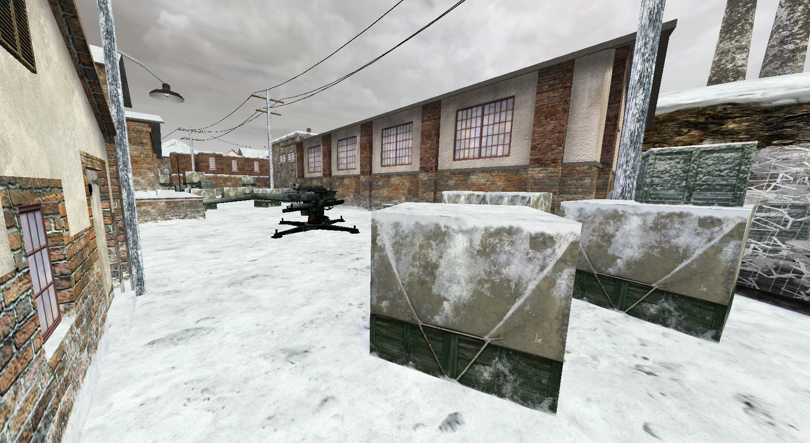
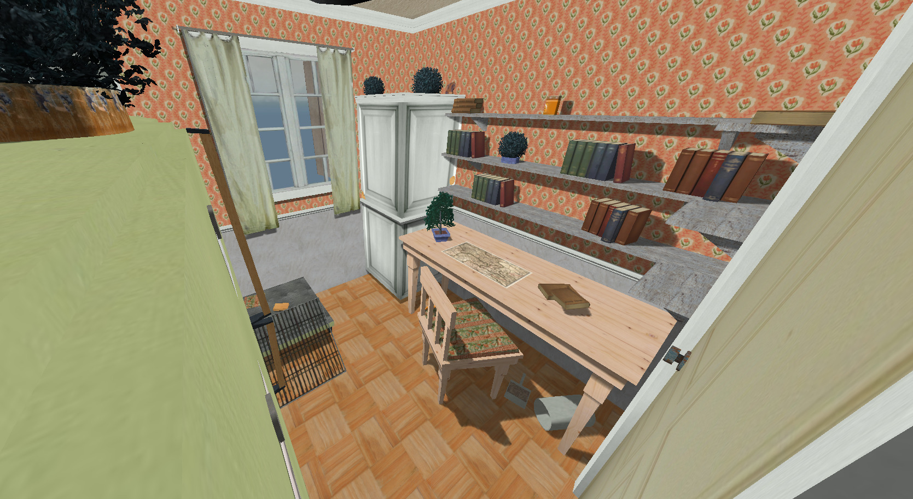

# Map Viewer for Call of Duty

This project is a browser-based viewer for Call of Duty maps, specifically supporting maps from Call of Duty 1 and Call
of Duty: United Offensive. It uses [babylon.js](https://babylonjs.com) for rendering, allowing you to explore these maps
in a 3D environment directly in your browser.

## Key Features

- View maps from Call of Duty 1 and Call of Duty: United Offensive directly in your browser.
- All original assets
- Load and display original assets, including:
    - 3D models
    - Skyboxes
    - Lightmaps
    - Ambient audio

## Future Potential

Support for Call of Duty 2 and Call of Duty 4 maps could be added with minimal effort.

## Known Issues

- Bad character controller
- Z-fighting
- Missing water animations
- Transparency
- Incorrect model rotations: Happens if they were rotated in multiple axes

## Contributing

Contributions are welcome! If you’d like to improve this project, feel free to:

- Open an issue for suggestions or bug reports.
- Submit a pull request with your changes.

## Running Locally

Follow these steps to set up the project locally:

- Clone this repo
- Create the `public/cod/` folders. Extract all your `.pk3` files into this folder.
- Create the file `public/cod/index`. This file should contain a list of _all_ the files in the folder (and
  sub-folders).
    - Example linux command to do this: `find . -type f -printf '%P\n' > index`
    - Example PowerShell command to do this:
      `Get-ChildItem -Recurse | Where-Object { -not $_.PSIsContainer } | ForEach-Object { $_.FullName.Replace((Get-Location).Path + "\", "").Replace("\", "/") } | Sort-Object | Set-Content index`
- run `npm install`
- run `npm run dev`
- A local server should be accessible at `http://localhost:3000`

## Acknowledgments

This project relies heavily on the work of these 2 projects:

| Original                                                                                    | Author     | TS translation                                             |
|---------------------------------------------------------------------------------------------|------------|------------------------------------------------------------|
| [LibBSP](https://github.com/wfowler1/LibBSP)                                                | wfowler1   | [libbsp-js](https://www.npmjs.com/package/libbsp-js)       |
| [Call of Duty asset importer for Blender](https://github.com/mauserzjeh/cod-asset-importer) | mauserzjeh | [libxmodel-js](https://www.npmjs.com/package/libxmodel-js) |

## Legal Disclaimer

This project is not affiliated with or endorsed by Activision or any other rights holders of the Call of Duty franchise.